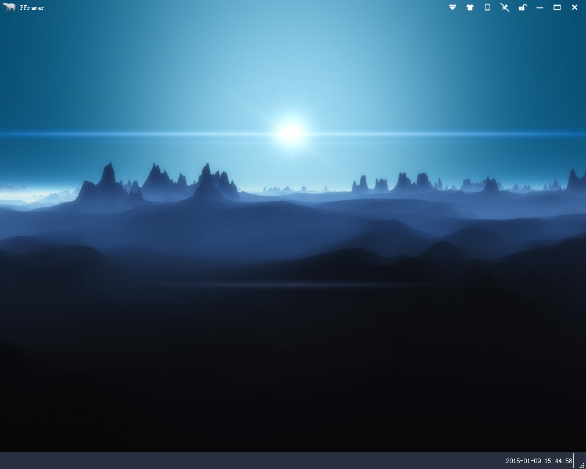

PFramer
=======

##### 1. 什么是PFramer?
PFramer是[QFramer](https://github.com/dragondjf/QFramer)的Python增强版本。

##### 2. 特性:

+ 兼容 PySide/PyQt4/PySide2的各个版本
+ 兼容python2.7 和 python3.4
+ 完整的qss换肤机制
+ 可重用模块qframer,对Qt基础控件进行二次封装

#####3. 使用：
直接运行main.y即可
  
      python main.py

##### 3. 预览

#####4. 协议:
遵循GNU GPL v3协议。

参考第三方库：

+ [QFramer](https://github.com/dragondjf/QFramer)
+ [pyqode.qt](https://github.com/pyQode/pyqode.qt)
+ [objbrowser](https://github.com/titusjan/objbrowser)
+ [pluginbase](https://github.com/mitsuhiko/pluginbase)
+ [QPFramer](https://github.com/dragondjf/QPFramer)
